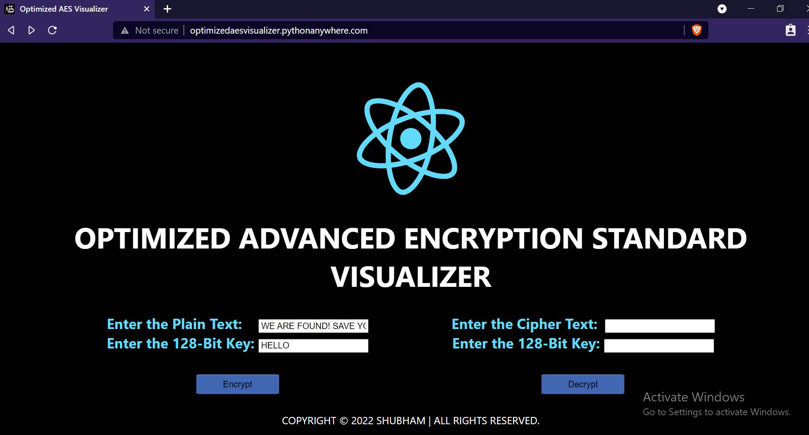

# Optimized AES Visualizer
  An Optimized Implementation and Visual Representation of Advanced Encryption Standard (AES)
  
## Deployed Link: 
  http://optimizedaesvisualizer.pythonanywhere.com <br/>



## ✔ Description

This is the implementation of an optimized version of AES with 128-bit block size with NO restriction on key size. The key can even be as small as 1 character! It uses a hashed Key for encryption-decryption using the standard SHA-512 hashing algorithm. The implementation also improvises the ShiftRows Transformation of AES round. This also includes a visual representation of all the processes. It improves the Avalanche effect of AES from 49.625% to 50.1% for given pairs.

## ✔ Salient Features

- Attractive and Responsive UI
- High Speed Encryption-Decryption
- Highly Secure Hashing and Encryption Algorithms
- Improved efficiency over standard AES
- Interactive Visual Representation

## ✔ How It works :
- To encrypt/decrypt a text, enter the text along with the key in the input box as per the requirement.
- Press Encrypt/Decrypt Button
- The new page will display the ciphertext/plaintext as well as all the steps involved in the process with th ehelp of diagrams and animations

## ✔ Technologies used :
- HTML
- CSS
- Python
- Flask

## ✔ To run the repository on the system:

- Clone the repository using "git clone https://github.com/tiwarishubham635/Optimized-AES-Visualizer.git"
- Run the following command:

```
python app.py
```
